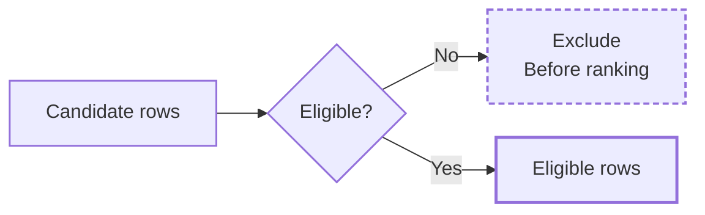
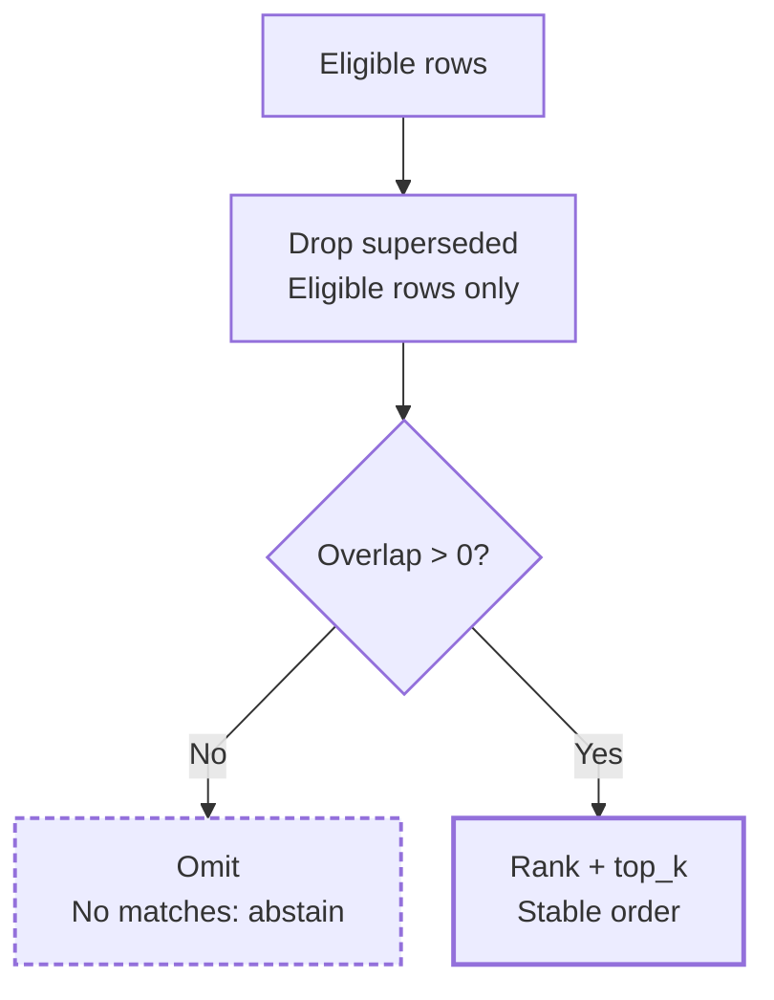

# Temporal Memory Core

A Python implementation of temporal memory eligibility: decide what was known, what was valid, and what was allowed for a specific use **before** relevance ranking begins.

**Even a perfect text match does not get a time machine.**

This public sample comes from my private Niyam-AI memory work. It exposes the retrieval rules with synthetic records; I can build and adapt the surrounding memory stores, search layers, and application integrations.

## Eligibility: decide what may enter retrieval

Check knowledge time, valid time, use permission, and active status in that order. The exact conditions are listed below.

## Ranking: supersession first, relevance second

Only eligible rows can supersede another memory. Then lexical overlap decides whether a surviving row belongs in the result; no overlap means omission, and no matching rows means abstention.

## Eligibility before relevance

`retrieve()` narrows candidates in this order:

1. **Known by `known_at`?** `learned_at <= known_at`; otherwise exclude future knowledge.
2. **Valid at `at`?** `at` must fall inside the record's valid-time interval.
3. **Allowed for this use?** `required_use` must be in `allowed_use`.
4. **Active?** `status` must equal `"active"`.
5. **Superseded by an eligible row?** Only rows that survived the first four gates can supersede older rows.
6. **Relevant?** Remaining rows receive lexical token-overlap scores; zero-overlap rows are dropped, then results are sorted and truncated to `top_k`.

An ineligible row cannot score its way back into a result, and a future or forbidden superseding row cannot erase an older eligible memory.

## Two clocks, one example

Suppose an office moved on **February 1**, but the system learned that fact on **February 10**:

| Clock | Timestamp | Meaning |
|---|---|---|
| Valid time (`valid_from`) | `2026-02-01T00:00:00Z` | The move is true in the world from February 1. |
| Learned time (`learned_at`) | `2026-02-10T00:00:00Z` | The system first knows that fact on February 10. |

For a historical query at `at=2026-02-05T00:00:00Z`:

| `known_at` | Result | Why |
|---|---|---|
| `2026-02-20T00:00:00Z` | include | The system now knows the move was already true on February 5. |
| `2026-02-05T00:00:00Z` | exclude | That view cannot use knowledge learned five days later. |

That is why world time (`at`) and knowledge time (`known_at`) are separate.

## Inspect the implementation

| File | Responsibility |
|---|---|
| [`time.py`](src/temporal_memory/time.py) | UTC parsing, knowledge-time and valid-time semantics |
| [`filters.py`](src/temporal_memory/filters.py) | use permission, lifecycle, eligible-only supersession |
| [`ranking.py`](src/temporal_memory/ranking.py) | lexical scoring, abstention, deterministic ordering |
| [`tests/`](tests/) | time, filtering, supersession, ranking, and retrieval behavior |

Verification commands and expected checks: [`docs/verification.md`](docs/verification.md).

## Scope

The repository uses synthetic records and lexical token overlap. It does **not** include personal memory data, ChatGPT exports, persistence, embeddings/vector search, a model adapter, or production access controls.

See [`SECURITY.md`](SECURITY.md), [`PROVENANCE.md`](PROVENANCE.md), [`docs/invariants.md`](docs/invariants.md), and [`docs/eligibility-table.md`](docs/eligibility-table.md) for the narrower contracts.
